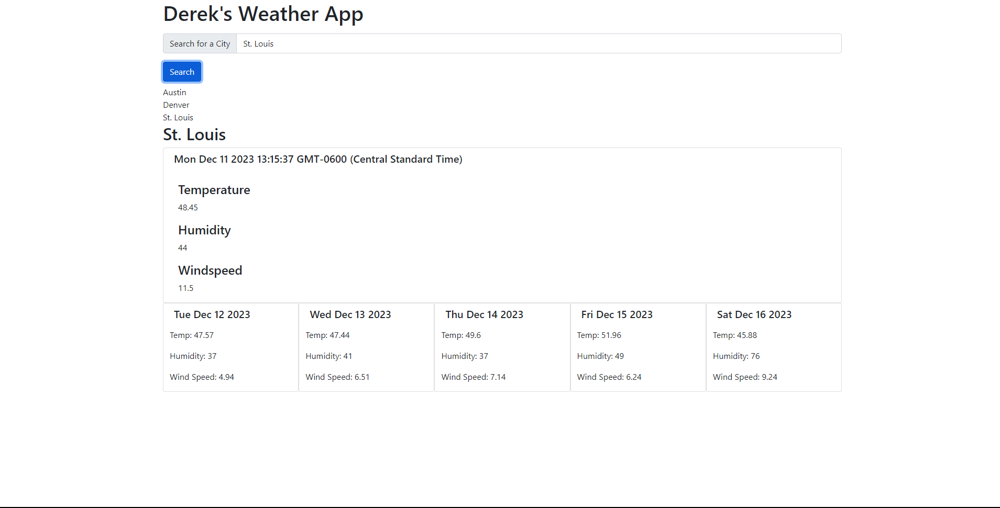

# Weather Dashboard 

## Description
- My motivation for this project was to create a working weather forecast app.
- I built this project using JavaScript, HTML, CSS, and Bootstrap.
- This app allows the user to get a weather forecast by typing in the name of their city.
- I learned from making this application how to integrate an API's functionality into a Javascript application.

## Installation
- N/A

## Usage
- Type in the name of your city in the searchbox and select 'search' to display your city's weather forecast. Your search history will be saved.

## Credits
N/A

## License
MIT
