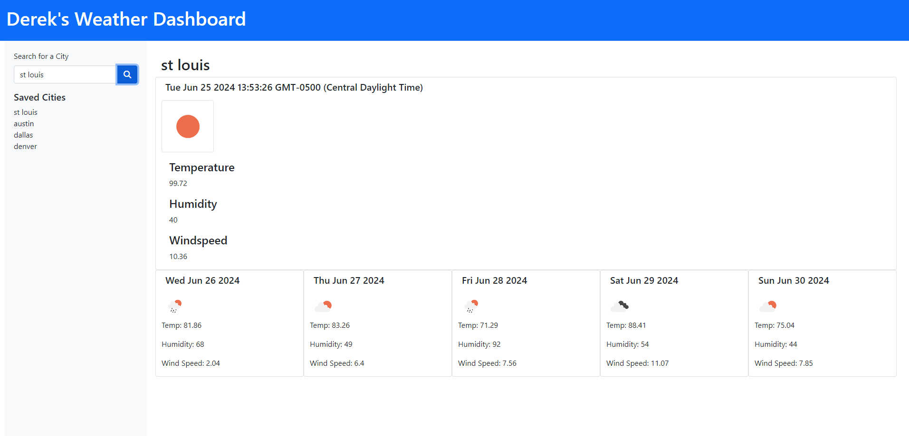

# Weather Dashboard 

## Description
- This application is designed to provide real-time weather forecasts for the user's city of choice. 
This application uses JavaScript, HTML, CSS, and Bootstrap, and integrates the OpenWeatherMap API.
This project demonstrates the integration of external API functionalities into a JavaScript-based application.

## Installation
- No installation is required for this application. Simply click the link to open in your web browser.

## Usage
- To use the Weather Dashboard:
    1. Enter the name of your city in the search box.
    2. Click the 'Search' button to view the weather forecast for your city.
    3. The application will save your search history for future reference.

https://derekm129.github.io/weatherDashboard/

## Credits
N/A

## License
This project is licensed under the MIT License.
